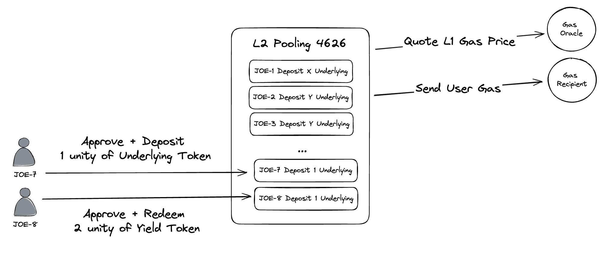
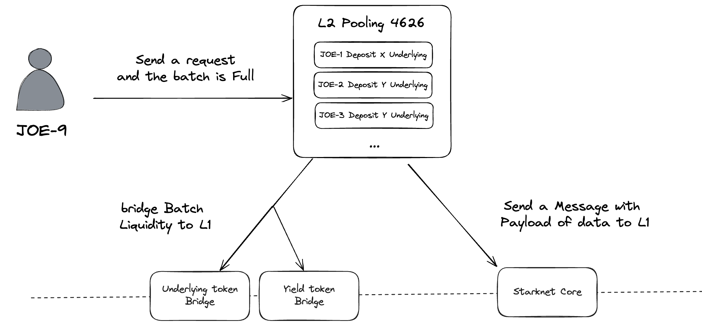
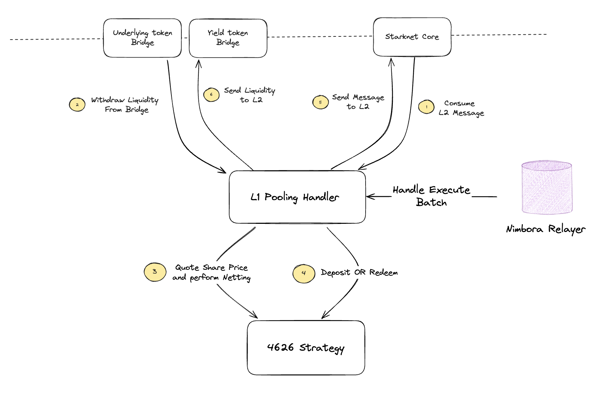

# Nimbora Toolkit

This repository offers a combination of Cairo and Solidity code designed to create a DeFi pooling system. It enables interaction with Ethereum's 4626 standardized yield strategies from Starknet.


## Pooling Flow

The first phase consists in aggregating users deposit and redeem requests from Starknet. Each will pay a fraction of Ethereum L1 Gas fee to participate to the "batch". People that want to deposit will approve and transfer the underlying token of the 4626 strategy and reciprocally, people that want to redeem will approve and transfer the yield token of the strategy .The L1 Gas cost is obtained from an oracle.


The second phase consists in sending the batch filled of transaction to the L1. It can happens if the batch is full (enought gas has been paid) or when the governance decides (even if not full). The liquidity is sent to L1 via conninical bridge (starkgate) and a message is sent to the L1 handler. This message contains all the required data that L1 Handler needs to know to interact with the L1 strategy. 



The third phase consists in handling the batch on L1 and executing user requests inside of it. This can only happens when the message is received on L1 (takes 12-16 hours currently). Anyone can execute the message handling on the L1 Pooling contract since the calldata will be verified when consuming message via the starknet core contract. After consuming the message, the liquidity will be withdrawn from the underlying token and the yield token. Better than doing one deposit and one withdraw, the share price will be quoted and a netting will be performed. It will always result in an excess of deposit or and excess of withdraw, that will be executed via the 4626 strategy. Finally, all tokens are sent back to L2 through the same bridge and a message is sent.



The fourth and last phase consists is executed automatically. When the message is received on L2, tokens will be sent to the contract and starknet will execute the L2 handling function, with all the information required such as the balance of underlying and yield tokens. After this function is executed, everyone that participated in the batch will be free to harvest their tokens: yield token for depositors and underlying for redeemers.


## Repository Struture

The repository is composed of 2 main folders: L1 and L2.

### L2 repository

We are using scarb build toolchain (scarb 2.3.1) and openzeppelin library for (ERC20 + Ownable). 

The src folder contains all the cairo contracts: 

- **batch**: Cairo Component designed to help managing batch operations and gas payment.

- **gas_oracle**: L1 Gas oracle contract.

- **token_bridge**: Starkgate mock, can be used for devnet or testnet if one of the token has not native bridge.

- **token_mock**: token mock with allowed mint and burn methods, to work with starkgate bridge, can be used for devnet or testnet if yield token not available.

- **pooling4626**: The L2 pooling contract


#### Compile

```sh
scarb build
```

#### Scripts

Only the declare and deploy scripts are avaialble, add the one you need in this folder.

Add your account address, private key and infura rpc (as shown in the .env.exemple). Head to scripts folder.

install dependencies

```sh
yarn
```

**declareContracts**: 

```sh
npx ts-node declareContracts.ts
```
**deployContracts**: 

```sh
npx ts-node deployContracts.ts
```


### L1 repository

We are using hardhat hardhat as Ethereum development environment.

Contracts are in the contracts repository: 

- **PoolingHandler**: The L1 pooling contract used to handle and execute batch.

- **StarkGate**: Starkgate bridge mock for ERC20

- **StarkGateEth**: Starkgate bridge mock for ETH

- **ERC20Mintable**: ERC20 Mock

- **Starknet**: Starknet core contract Mock

install dependencies

```sh
yarn
```

Compile

```sh
yarn compile
```

#### Scripts

Add your deployment script in the "deploy" repository and deploy contracts with the following command. (you'll find an exemple with starkgate bridge mock deployment)

```sh
yarn hardhat deploy
```

Add other scripts in the "scripts" repository and interact with your contracts with the following command. (you'll find an exemple with prepare starkgate bridge)

```sh
yarn hardhat run <scriptName>
```


### Get Started

## Choose a 4626 Strategy

You can access all the 4626 ethereum yields from this link
https://erc4626.info/vaults/

## Interact with the vault on L1

The PoolingHandler handler is already designed to interacty with a 4626 standardised vault but each yield has its own particularity, can be pause, can have entry/exit fees, redeem can be blocked ...
Make sure to adapt pooling contracts to manage all of those cases! 

Exemples: 

- Lending pool redeem can be block when the pool utilization is full/almost full. In this case you may want to bridge back funds and give an additional argument in the data payload sent to L2 : "poolAvailable". Then L2 contracts won't be able to send batch until pool utilization goes down.

event BatchProcessed(
        uint256 nonce,
        uint256 amountUnderOut,
        uint256 amountYieldOut,
        bool poolAvailable
    );

- Yield aggregators can set withdrawal fee when too many people want to withdraw in the same period. In In this case you'll have to set additional parameters such as the slippage and a threshold on the time (since you can always delay the batch execution waiting for fees to go lower).

Also most of strategies do not exactly fit to the 4626 standard and can add additional arguments such as yearn vaults V2, you'll probably have to change the way PoolingHandler contract interact with the yield.

function withdraw(
    uint256 assets,
    address receiver,
    address owner,
    uint256 max_loss,
    address[] memory strategies
) external returns (uint256);


max_loss and strategies are two optional arguments but may be important to specify. 


## L1 <> L2 interaction

If you modified the PoolingHanlder logic and the messaging data payload, make sur to modify your L2 contract in consequence. 

Since the tokens available in official bridge are limited, you'll probably have to deploy your own token and bridge for the yield bearing share token of the strategy. You can use mocks in this repository.


